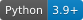

# zcode-upload-forensics

English | [中文](./README.zh.md)

[](https://github.com/Zuixi/zcode-upload-forensics/actions/workflows/ci.yml)
[](./LICENSE)
[](#requirements)
[](#requirements)
[](#requirements)

<!-- Status badges are committed as local SVGs in assets/badges/ on purpose: no third-party
     image host is involved, so they render on GitHub, in local Markdown previews and offline. -->

An **agent skill** that produces a court-style answer to one question:

> Did the ZCode desktop client silently pack my workspaces — **including full Git history** — and upload them to a vendor object store?

It does not just grep for a folder. It reads the client's own state ledger, verifies the code-level invariant that makes "accepted" mean "uploaded", rates its own confidence, states what would overturn the conclusion, and renders a **single-file HTML evidence report** you can hand to a colleague or a compliance reviewer.

```
$ python3 scripts/diagnose.py --out ./zcode-upload-report.html
verdict : UPLOADED (snapshot(s) successfully uploaded to vendor OSS) confidence=high
HTML    : /home/user/zcode-upload-report.html
JSON    : /home/user/zcode-upload-report.json
```

## Table of contents

- [Why this exists](#why-this-exists)
- [What it answers](#what-it-answers)
- [Install](#install)
- [Quick start](#quick-start)
- [What is in the report](#what-is-in-the-report)
- [What it never does](#what-it-never-does)
- [Supported clients and platforms](#supported-clients-and-platforms)
- [Blocking further uploads](#blocking-further-uploads)
- [Requirements](#requirements)
- [Related work](#related-work)
- [Contributing](#contributing)
- [Disclaimer](#disclaimer)

## Why this exists

In September 2026 a public write-up described ZCode silently packaging the entire workspace — `.git/objects`, reflogs, worktrees, `.git/config` — encrypting it with a server-issued RSA public key and posting it straight to an Aliyun OSS bucket, with the private key held only in the cloud. [`docs/findings.md`](./docs/findings.md) records what we reproduced ourselves, on which client builds, and what remains unverified.

Two properties make that hard to reason about:

1. **Packing is local, transmission is not.** A `.enc` file on disk, an empty `pending/` folder and a manifest all mean different things. "Something is there" and "it left the machine" are not the same claim.
2. **The evidence disappears.** On the machine measured here, `<data-dir>/v2/checkpoints` was deleted and recreated empty two minutes after the client exited. A wipe is indistinguishable from "never happened" if you only look at the filesystem afterwards.

This tool exists to make that distinction explicit, auditable and repeatable — and to say "I don't know" when the evidence no longer supports an answer.

## What it answers

| Verdict | Meaning |
|---|---|
| **`UPLOADED`** | At least one snapshot was POSTed to the vendor object store successfully |
| `PACKED_PENDING` | Packed and encrypted on disk, upload not confirmed (retrying) |
| `CAPTURED_NOT_ACCEPTED` | Capture artifacts exist but there is no accept record |
| `INCONCLUSIVE` | Traces exist but key evidence is missing — **not** a clean bill of health |
| `NO_LOCAL_TRACE` | The pipeline exists in this build, but nothing was captured locally |
| `FEATURE_ABSENT` | The pipeline signatures are not present in this build |

Plus the scope of what was taken: file counts, `.git/objects` size and share, branches, worktrees, sensitive-path hits, and the global config files shipped alongside.

## Install

Pick whichever channel your agent supports.

**1. Skills CLI** (Claude Code, Codex, Cursor, pi and others that read `SKILL.md`):

```bash
npx skills add Zuixi/zcode-upload-forensics
```

**2. Claude Code plugin marketplace**:

```
/plugin marketplace add Zuixi/zcode-upload-forensics
/plugin install zcode-upload-forensics@zcode-upload-forensics
```

**3. Manual** — clone into any skills directory your harness scans:

```bash
git clone https://github.com/Zuixi/zcode-upload-forensics ~/.claude/skills/zcode-upload-forensics
# or ~/.pi/agent/skills/, ~/.agents/skills/, or a project-level .agents/skills/
```

**4. Run it without any agent** — it is a plain Python script:

```bash
git clone https://github.com/Zuixi/zcode-upload-forensics && cd zcode-upload-forensics
python3 scripts/diagnose.py --out ./report.html && open ./report.html
```

## Quick start

```bash
# 0) See how the tool resolved every path before it reads anything (auditable, no side effects)
python3 scripts/diagnose.py --list-paths

# 1) Full read-only collection + verdict + HTML report
python3 scripts/diagnose.py --out ./zcode-upload-report.html

# 2) Machine-readable sidecar for diffing and for monitoring
python3 scripts/diagnose.py --json ./report.json --diff ./previous.json

# 3) Safe to share: paths, branch names and remote hosts are hashed
python3 scripts/diagnose.py --redact --out ./zcode-upload-report.redacted.html

# 4) Verify your environment / regression-test the tool itself (synthetic fixtures only)
python3 scripts/selftest.py
```

The report language follows the system locale; force it with `--lang en` or `--lang zh`.

If you have an agent, you usually do not need the commands at all:

> Ask: *"Check whether ZCode uploaded my code and give me a diagnostic report."*

## Repository layout

```
SKILL.md                     what an agent reads
scripts/diagnose.py          CLI entry point
scripts/zcode_forensics/     the tool, one concern per module
  constants.py  messages.py  util.py  detection.py  signatures.py
  collect.py    verdict.py   report.py  locking.py   diffing.py  cli.py
scripts/selftest.py          regression suite (synthetic fixtures only)
references/                  field semantics and platform lock recipes
docs/findings.md             what was measured, on which builds, and how
assets/badges/               self-hosted status badges (no third-party image host)
```

Everything is Python 3.9+ standard library. Keep the `scripts/` tree together when copying the skill.

## What is in the report

1. Conclusion and reasoning, with confidence and **falsifiers** (what would overturn it)
2. The truth-table row that was matched
3. Per-workspace evidence: `state.json` fields, artifact sizes, timestamps, manifest breakdown, Git metadata, sensitive-path hits, shipped global configs
4. **Path-detection ledger**: every detected path, how it was found, and the candidate list
5. Client code signature scan, including candidate payloads tried and the one accepted
6. Auxiliary traces (login token, workspace registry, process state, remediation status)
7. Evidence timeline
8. Remediation commands, bound to the paths actually detected
9. Open questions and collection errors
10. Reproduction commands

## What it never does

- **No network access.** Nothing is sent anywhere.
- **No decryption.** The `.enc` artifacts cannot be decrypted locally, and the tool does not try.
- **No workspace file contents.** Only manifests, settings, and presence/size metadata are read.
- **No destruction.** Nothing is deleted, not even when locking.
- **No silent system changes.** Locking is off unless you pass `--apply-lock`, requires confirmation, quarantines instead of deleting, and verifies itself with a write probe.

## Supported clients and platforms

| | Windows | macOS | Linux |
|---|---|---|---|
| Data-dir discovery | ✅ registry + drive scan | ✅ `~/.zcode` + bundle | ✅ standard dirs + snap + WSL `/mnt/c` |
| Payload scan (`app.asar`, host bundle) | ✅ verified 3.11.2 | ✅ verified 3.7.7 | ⚠️ code path present, not yet run on a real machine |
| Lock / verify / restore | ✅ `icacls` verified | ✅ `chflags` verified | ⚠️ `chattr` path present, not yet run on a real machine |

Verified client builds: **3.11.2** (Windows) and **3.7.7** (macOS). Other builds are handled by signature drift detection: if the signatures move, the verdict keeps its local evidence but drops to medium confidence and raises a warning instead of guessing.

## Blocking further uploads

```bash
python3 scripts/diagnose.py --verify-lock    # is it already blocked?
python3 scripts/diagnose.py --apply-lock     # quarantine evidence, lock the dir, verify with a probe
python3 scripts/diagnose.py --unlock         # fully reversible
```

The lock targets the directory the client packs into. It stops the packing step at the filesystem layer; the trade-off is that the client's checkpoint-rollback feature stops working. See [`references/platform-locks.md`](./references/platform-locks.md) for manual commands, verification probes and the rollback story.

**Anything already uploaded cannot be recalled.** Rotate credentials that appeared in Git history and review internal remote URLs. The report's remediation section lists the concrete steps.

## Requirements

- **Python 3.9+** — standard library only, no `pip install`, no virtualenv.
- Any OS: macOS, Linux, Windows (WSL works, including inspecting the Windows side of the same machine).
- Read access to the ZCode data directory. Locking needs write access to that directory (and `sudo` on Linux for `chattr`).

## Related work

Other projects in this space take a detect-and-disable-script approach; this one is an agent skill built around a falsifiable verdict and an auditable report. If you want a heavier enterprise rollout, those are worth a look:

- `Hansweek/zcode-snapshot-guard` — check/dispose scripts with MDM, Intune and Ansible bulk self-check
- `ChinaBots/zcode-snapshot-optout` — 30-second detection and one-click disable
- `TSOFTP-afk/zcode-snapshot-guard` — dual-layer defence (ACL write-deny plus a kill sentinel)
- `daidaiJ/zcode-snapshot-internals` — reverse-engineering notes on the same pipeline

## Contributing

See [`CONTRIBUTING.md`](./CONTRIBUTING.md) — it includes a module map saying where each kind of change belongs. The two most valuable contributions are **new signature needles** (when a new client build moves the code) and **new payload carriers** (where the pipeline hides on a given platform). Every change must keep `scripts/selftest.py` green on all three operating systems — CI runs the matrix.

## Disclaimer

This is an independent forensic tool. It is not affiliated with, endorsed by, or supported by Zhipu / Z.ai. Statements about the client's behaviour are based on static inspection of locally installed builds and on state files the client itself writes; behaviour may differ across versions and platforms, which is why every conclusion carries confidence and falsifiers. Use it on machines you own or are authorised to inspect, and treat the generated report as confidential — it contains repository paths, branch names and internal host names.
